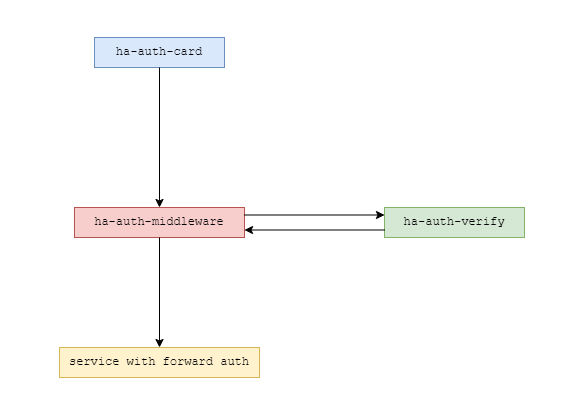

# Authentication Component Overview

WARNING: This project is still in development and not yet ready for production use.

This authentication system is designed to integrate with Home Assistant and Traefik, leveraging Home Assistant's access token to authenticate users. It consists of three main sub-components:

1. **Authentication Card** ([ha-auth-card](https://github.com/TritonNET/hass-auth-card))  
2. **Authentication Middleware** ([ha-auth-middleware](https://github.com/TritonNET/ha-auth-middleware))  
3. **Authentication Verify** ([ha-auth-verify](https://github.com/TritonNET/ha-auth-verify))  

---

### **Authentication Card (ha-auth-card)**

The `ha-auth-card` is a custom card for **Home Assistant** that manages the access token for authentication purposes.  

- When a user logs into Home Assistant, this card retrieves the user's access token and appends it to a cookie in the browser.  
- The access token stored in the cookie is then used for authentication by the `ha-auth-middleware`.  
- This allows seamless authentication into services secured by Traefik without requiring the user to re-enter credentials.

**Key Functionality**: Enables Home Assistant to share the user's access token securely with the middleware for authentication.

---

### **Authentication Middleware (ha-auth-middleware)**

The `ha-auth-middleware` is a **Traefik middleware** designed to handle incoming requests and authenticate them using Home Assistant's access token.  

- It retrieves the access token from the cookie in the incoming request.  
- The token is verified by the `ha-auth-verify` service, which communicates with Home Assistant to ensure the token is valid.  
- Once verified, the middleware extracts the authenticated user's email address from the response and forwards it to the target service via a configured authentication header.

**Key Functionality**: Provides secure token verification and forwards the authenticated email address to downstream services for user identification.

---

### **Authentication Verify (ha-auth-verify)**

The `ha-auth-verify` service is responsible for validating access tokens issued by Home Assistant.  

- It receives the access token from the `ha-auth-middleware` and sends a verification request to Home Assistant.  
- If the token is valid, Home Assistant responds with user details, including the email address.  
- The email address is then returned to the middleware, which includes it in the authentication header passed to the target service.

**Key Functionality**: Acts as the bridge between the middleware and Home Assistant for token validation and user data retrieval.

---

This system ensures a secure and seamless authentication flow by utilizing Home Assistant's access token to authenticate users in Traefik, validate the token with Home Assistant, and forward the authenticated user's email address to the target service.
